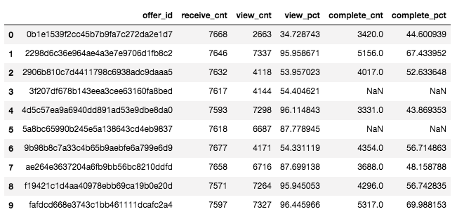

# 简介
星巴克提供了一批数据包含每个推送的相关信息，人们对推送的反应接收，阅读，成交三种，人们的基本信息三个数据集，我们需要通过这些数据去分析哪些推送的效果比较不错，然后针对人群对推送的行为数据，人群的基本信息和推送的基本信息搭建一个机器学习模型来预测什么样的人群在什么样的推送下是否会进行购买。

# 目标
建立一个预测模型去预测人是否会使用推送进行购买

# 数据集
一共有三个数据文件：

* portfolio.json – 包括推送的 id 和每个推送的元数据（持续时间、种类等等）
* profile.json – 每个顾客的人口统计数据
* transcript.json – 交易、收到的推送、查看的推送和完成的推送的记录

以下是文件中每个变量的类型和解释 ：

**portfolio.json**
* id (string) – 推送的id
* offer_type (string) – 推送的种类，例如 BOGO、打折（discount）、信息（informational）
* difficulty (int) – 满足推送的要求所需的最少花费
* reward (int) – 满足推送的要求后给与的优惠
* duration (int) – 推送持续的时间，单位是天
* channels (字符串列表)

**profile.json**
* age (int) – 顾客的年龄 
* became_member_on (int) – 该顾客第一次注册app的时间
* gender (str) – 顾客的性别（注意除了表示男性的 M 和表示女性的 F 之外，还有表示其他的 O）
* id (str) – 顾客id
* income (float) – 顾客的收入

**transcript.json**
* event (str) – 记录的描述（比如交易记录、推送已收到、推送已阅）
* person (str) – 顾客id
* time (int) – 单位是小时，测试开始时计时。该数据从时间点 t=0 开始
* value - (dict of strings) – 推送的id 或者交易的数额

# 方案
* 首先，通过数据预处理profile的信息，将客户行为拆分出来
* 通过漏斗分析，评价不同推送的效果如何
* 数据处理：聚合客户的行为数据，做出行为特征，并合并人群基本信息，推送基本信息，建立训练和测试样本
* 训练模型
* 对模型进行效果评价，并提出可进行改进的建议

# 简单数据统计及各offer转化
* 通过拆分出的客户行为：收到，阅读，完成offer建立一个三级的**漏斗分析**，来分析哪个推送的转化率比较高。
拆分transcript这个数据集后，发现：\
    收到offer人数: **16994** \
    查看offer人数: **16834** \
    进行交易人数: **16578** \
    完成offer人数: **12774** \
整个数据集并不大，一共也就10各推送，因此很快就通过pandas很快得出以下表格：\
\
可以看到index为9的推送是表现最好的，view_pct阅读率高达96.4%为最高，complete_pct转化率为70.0%也为最高。同时也可以看到其中有两个推送是没有转化率的，查看portfolio,可以发现因为它们只是推送提醒并没有优惠券或买一送一。而index为9的推送之所以能取得这样的效果也是因为它的**渠道最多，难度最大，持续时间最长**：\
\

# 建模数据探索
- 根据三个不同的数据集，可以将待选因子总结为以下三个方面：\
  - offer性质相关的因子: difficulty, duration, channels, offer_type, reward
  - 客户基本信息相关的因子: age, 成为会员的时间， sex, income
  - 客户历史行为：平均交易金额，查看offer距离收到offer的平均时长view_gap，查看offer的次数view_times

* 客户平均交易金额
大多数的交易金额都小于10元，因此去除大于10元的情况下，可以下看到下面的histgram：\
如果使用逻辑回归的方式建模的话，肯定是要将特别大异常值进行去除或者进行分箱增加模型鲁棒性。\
\
同理的还有，客户查看offer的次数view_times \
\

* 客户基本信息分析
 * 客户的年龄分布如下：\
\
可以发现客户的年龄平均在50至60岁，但明显有些异常数据，高于100岁的应该属于异常值，需要加以去除或者分箱。
 * 客户的收入分布如下：\
\
可以看到客户收入属于右偏的正太分布，没有什么太大问题。
 * 客户的年龄分布如下：\

    |性别|数量|
    |-|-|-|
    |M|8484|
    |F|6129|
    |O|212|

* 各offer的基本信息分析
 * 每个offer都有difficulty,duration,channels,offer_type,reward的信息，其中difficulty,duration和reward均为连续型变量，offer_type,channels是离散型变量，如果使用线性的模型时，需要做独热编码处理。

* 缺失值处理
  将数据按照person_id和offer_id merge之后我们得到了建模所需要的数据，接下来将做缺失值处理：
  其中出现缺失的有如下字段：\

    |字段|缺失率|
    |-|-|-|
    |view_gap|6.2%|
    |amount_mean|24.7%|
    |view_times|6.2%|
    |income|12.7%|

其中，view_gap, amount_mean, view_times都是我们自己加工的字段，缺失代表了客户并没有查看推送或者发生交易，因此有实际意义将其填充为0。而income则为原始数据，代表没有提供到真实的数据，因此我们将其使用平均值填充。最后加工而成的变量如下：\
 * amount_mean: 平均交易金额
 * difficulty：offer推送难度
 * duration：持续时长
 * reward：优惠力度
 * became_member_on: 成为会员日
 * view_times: 查看推送次数
 * offer_type: offer种类
 * income：收入
 * age：年龄
 * view_gap：查看offer距离收到offer的平均时长
 * gender：性别
 * is_social：是否社交推送
 * is_mobile：是否通过手机推送
 * is_web：是否网络端推送
 * is_email：是否邮件推送

# 训练集与测试集切分：
为了更好地训练模型和评价模型，我们将数据集切分为比例为7:3的训练集和测试集，并最终将使用测试集评价模型效果和是否过拟合，使用了sklearn的model_selection模块的train_test_split方法：
```
X_train, X_test, y_train, y_test = train_test_split(X_new, tag_col, test_size=0.3,random_state=0)
```
# 特征重要性分析
因为打算使用gbdt这种回归树的集成模型，因此直接使用其feature_importances进行筛选，结果如下：\
\
可以看到amount_mean,difficulty,duration,reward都是比较重要的因子，而通过何种方式进行推送和性别确是比较差的特征。因此将这几个因子删除出数据集，然后使用train_test_split进行训练集和测试集的切分：
```
X_new=df_mid.drop(['complete_tag','is_email','is_web','gender','is_mobile'],axis=1)
tag_col=df_mid['complete_tag']
X_train, X_test, y_train, y_test = train_test_split(X_new, tag_col, test_size=0.3,random_state=0)
```
使用了gbdt先跑了一把模型:
```
param_test = {
        'learning_rate': [0.1, 0.05],
        'max_depth': [3,5],
        'n_estimators': range(50, 200, 50),
        'min_samples_split': [5, 20, 50, 70, 100]
        }
GBC = GradientBoostingClassifier()
gsearch = GridSearchCV(GBC, param_grid=param_test, scoring="roc_auc", cv=5)
gsearch.fit(X_train, y_train)
y_pred=gsearch.predict(X_test)
```
# 模型评价
## 模型评价指标选择：
* 对于模型形容训练调参评价标准，我选取了roc_auc_score作为评价标准；\
原因：ROC观察模型正确地识别正例的比例与模型错误地把负例数据识别成正例的比例之间的权衡。TPR的增加以FPR的增加为代价。ROC曲线下的面积即AUC是模型准确率的度量， ROC 曲线有个很好的特性：当测试集中的正负样本的分布变化的时候，ROC 曲线能够保持不变。这样不管随机抽样的正样本比例如何，评价模型的标准不会发生大的偏差。

因此，我使用了sklearn的GridSearch模块，对参数进行调参，评判标准采用了roc_auc,用5折交叉检验。
最后使用如下代码得到了混淆矩阵，准确率和最佳参数，得到的结果如下：

```
def display_results(cv, y_test, y_pred):
    labels = np.unique(y_pred)
    confusion_mat = confusion_matrix(y_test, y_pred, labels=labels)
    accuracy = (y_pred == y_test).mean()
    auc_score = f1_score(y_test, y_pred)
    
    print("Labels:", labels)
    print("Confusion Matrix:\n", confusion_mat)
    print("Accuracy:", accuracy)
    print("\nBest Parameters:", cv.best_params_)
    print("f1_score", auc_score)
display_results(gsearch, y_test, y_pred)
```

下面，我们再看具体看一下在测试集上的模型效果：

 * 混淆矩阵：

    |-|预测|预测|
    |-|-|-|
    |真实|8490|1786|
    |真实|846|7865|
* 精准度(precision, 或者PPV, positive predictive value) = TP / (TP + FP) 即 8490/(8490+846)=90.9%

* 召回率(recall, 或者敏感度，sensitivity，真阳性率，TPR，True Positive Rate) = TP / (TP + FN) 即 8490/(8490+1786)=82.6%

* F1-值(F1-score)用来综合评分精准度和召回率 = 2*TP / (2*TP+FP+FN) 即 2*8490/(2*8490+846+1786) = 86.6%

* 准确率指的是预测完全准确的比例 = (TP+TN)/(TP+TN+FP+FN) 即(8490+7865)/(8490+846+1786+7865)= 86.1%

 ** 注：TP真阳性，FP假阳性，FN：假阴性，TN：真阴性
* 最佳参数： {'learning_rate': 0.1, 'max_depth': 5, 'min_samples_split': 50, 'n_estimators': 100} \

* 从测试集上的效果看，精准度和召回率都还不错，也没有下降很多，没有发生过拟合的现象。

# 结果
目前经过一些简单的数据分析，和比较粗糙的建模方法得到了一个通过客户基本信息，客户历史行为特征和offer基本信息的数据去预测客户是否会对offer响应并完成offer的模型。
* 模型使用时的指标考虑：我个人理解，由于考虑到作为商业使用方，尽可能的去覆盖更多的客户，让更多的客户去使用这个offer，而且在实际使用中，一定是正负样本比例会很大，未使用的人远远多于使用的人数，在这种情况下使用准确率去评价会欠妥，因为我们更关注在预测出使用这部分的客户最终是否使用即精准度和总的预测出来使用的客户即召回率，从模型在测试集上的效果，90.9的精准度和82.6%的召回率，还是不错的。

# 困难及有趣之处
这次星巴克的数据集还是比较干净的，在数据预处理过程中没有碰到很大的困难，但是要去理解其中的商业逻辑还是需要通过数据集进行揣摩的。比如：通过拆分，我们的确可以发现客户大致存在三个行为：即收到offer，查看offer，使用offer，同时交易数据我们并没有办法去对应到相应的offer_id上，还有一些数据使用数据在查看和收到offer之前，因此有一些情况是需要考虑到的。因此有趣之处就在于需要通过数据去分析客户的行为是如何影响到他去使用或不使用offer。

# 可改进方向
目前针对户行为特征这块的数据还可以进一步的拆分，有些客户并不是因为offer而进行了交易，而纯粹是习惯了，甚至是完成offer后才查看到offer，因此需要将数据再进行一次拆分，针对那部分不是因为惯性的客户进行建模。

--------------------------
# 参考文献
浅析混淆矩阵：https://zhuanlan.zhihu.com/p/46204175\
百科ROC曲线：https://baike.baidu.com/item/%E6%8E%A5%E5%8F%97%E8%80%85%E6%93%8D%E4%BD%9C%E7%89%B9%E5%BE%81%E6%9B%B2%E7%BA%BF/2075302?fromtitle=ROC%E6%9B%B2%E7%BA%BF&fromid=775606#5\
sklearn文档：http://lijiancheng0614.github.io/scikit-learn/modules/generated/sklearn.ensemble.GradientBoostingClassifier.html
